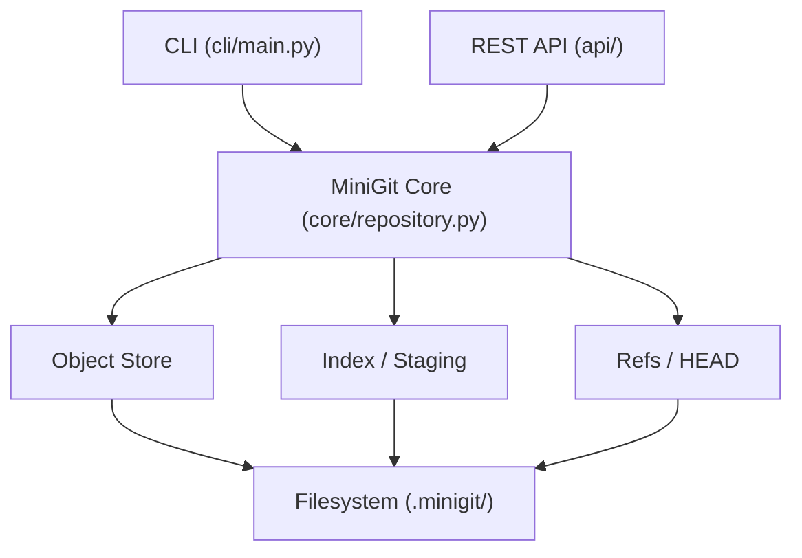
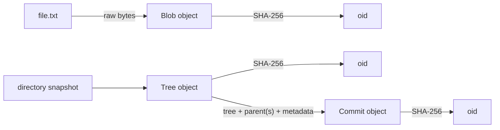
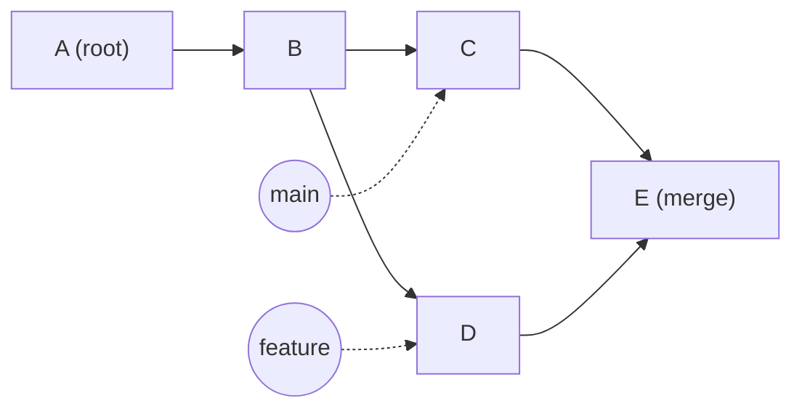
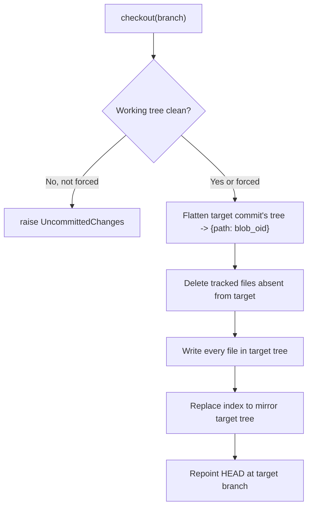

# MiniGit Architecture

This document explains *how* MiniGit works internally and *why* each
piece is built the way it is. It's written to be the thing you re-read
before an interview, not just a reference.

## 1. Layering



Neither the CLI nor the API contains any version-control logic. Both are
thin adapters that call the exact same `Repository` methods. This is
enforced by convention (there's no framework preventing a route from
reaching into `ObjectStore` directly), but every route in `api/routes/`
follows the same shape: parse input, call `Repository`/`checkout_branch`/
`merge_branch`, serialize the result. If you ever see business logic
(a loop over tree entries, a hash computation) inside a route or a CLI
command function, that's a bug — it belongs in `core/`.

## 2. Content-addressable storage

Every object — blob, tree, or commit — is serialized as:

```
"<type> <byte-length-of-body>\0<body>"
```

and its identity (the **oid**) is the SHA-256 hex digest of that entire
byte string, header included.



**Why hash the header too, not just the body?** Two reasons:
1. It ties an object's *type* into its identity — a blob and a tree that
   happened to have identical bytes still get different oids.
2. On read, MiniGit recomputes the size and the hash and refuses to
   return an object whose stored bytes don't match its filename. That's
   free corruption detection with zero extra bookkeeping.

Objects live at `objects/<oid[:2]>/<oid[2:]>` — the two-character
fan-out directory is purely to keep any single directory from
accumulating tens of thousands of entries as the repo grows; it has no
effect on correctness.

**Deduplication is a side effect of the write path, not a separate
feature.** `ObjectStore.write()` checks whether the target path already
exists before writing. An unchanged file staged across a hundred commits
produces the exact same blob oid every time, and after the first write,
every subsequent "write" is a no-op. `test_tree_deduplication_across_commits`
demonstrates this directly: committing a change to one of two tracked
files adds exactly 3 new objects (one blob, one tree, one commit) — the
unchanged file's blob is reused.

## 3. Trees, and why sorting matters

A tree's body is its entries — `(mode, type, hash, name)` — serialized
**in name-sorted order, always**. This is the detail that makes
directory-level content-addressing actually work: two directories with
identical file contents hash to the *same* tree oid regardless of the
order files happen to appear in on disk or in the index. Without sorting,
the same directory could hash differently on two different machines
depending on filesystem iteration order — which would break every
downstream assumption (checkout comparisons, dedup, diff).

## 4. The commit DAG

A commit is deliberately thin: a tree oid, zero or more parent oids, an
author, a timestamp, a message. Its own oid is a hash of all of that —
**including its parents' oids** — which has a consequence worth stating
plainly: a commit's identity encodes its entire ancestry. You cannot
edit a commit in place; changing anything about it (or any of its
ancestors) produces a different oid. History is append-only by
construction, not by policy.

Because a commit can have more than one parent (a merge commit), history
is a **DAG**, not a linked list. `Repository.log()` and
`Repository.log_all_branches()` both traverse it the same way — a
worklist walk over `commit.parents` with a visited-set — rather than
assuming a single `next` pointer. This is also why the graph view in the
frontend renders merge commits as regular nodes with two incoming edges
instead of needing special-case handling.



## 5. Refs, HEAD, and why branching is cheap

A branch is a single text file at `refs/heads/<name>` containing a
commit oid. Branch names may contain `/` (e.g. `feature/auth`), stored
as nested files exactly like Git does — `refs/heads/feature/auth`.

**Creating a branch never copies anything.** It's one file write. This
is the entire reason branching is O(1) regardless of repository size:
the branch *is* the pointer, and the commit graph it points into is
shared, immutable, content-addressed data that every other branch can
also point into without conflict.

HEAD is a **symbolic reference** — it stores the string
`"ref: refs/heads/main"`, not a raw commit hash. Committing on the
current branch therefore only requires updating one file (that branch's
ref); HEAD automatically "follows" because it's defined in terms of the
branch, not a snapshot of a specific commit. (Detached HEAD — HEAD
holding a raw hash directly — is supported at the *read* level for
robustness, but nothing in MiniGit's CLI or API ever constructs one;
it's explicitly out of scope.)

## 6. The index (staging area)

Deliberately much simpler than Git's real index (a packed binary format
with stat-based cache invalidation). MiniGit's index is a flat JSON file:
`{relpath: {"hash": oid, "mode": mode}}`. It records exactly one thing —
"what would be committed right now" — decoupled from both the working
tree and HEAD, which is what lets `status()` distinguish four states
per file (staged / modified-unstaged / untracked / deleted) instead of
just "changed."

## 7. Checkout



The safety check (refuse if dirty, unless `force=True`) is a deliberate,
simple gate — not an attempt to reproduce Git's full three-way checkout
merge logic. Correctness for the common case, documented limitation for
the rest.

## 8. Three-way merge

Merge is decided **per file first, then per line only if truly needed**:

1. `current == incoming` → already agree (including "both deleted").
2. `current == base` → only incoming changed it; take incoming.
3. `incoming == base` → only current changed it; keep current.
4. Otherwise, both sides diverged from base on this file. If either side
   deleted it, that's a modify/delete conflict (can't line-merge a
   deletion). Otherwise, fall through to the line-level merge.

The line-level merge (`core/diff3.py`) is a **from-scratch simplified
diff3**: diff base→current and base→incoming independently with
`difflib`, discard the "equal" spans, then walk both change-lists in
lockstep over base's line numbers. A span touched by only one side
applies cleanly; a span touched by both with identical resulting content
applies once; overlapping spans with different content become a
conflict block with `<<<<<<< CURRENT` / `=======` / `>>>>>>> INCOMING`
markers. One subtlety that took a real bug to get right: two pure
*insertions* at the same point (both sides appending after the same
line) must be treated as touching each other even though each is a
zero-width span in `difflib`'s output — otherwise they'd silently apply
in an arbitrary order instead of conflicting.

The **merge base** is found by BFS: collect every ancestor of the
current commit into a set, then walk the incoming commit's ancestry
until landing on a commit in that set. It is not the most efficient
possible lowest-common-ancestor algorithm, but it's easy to reason about
and correct for MiniGit's scale.

A clean merge (no conflicts) is committed automatically with two
parents. A conflicted merge stages every file that resolved cleanly and
leaves only the conflicted files unstaged with markers written into the
working tree — so `status()` shows exactly what still needs manual
resolution, and a normal `add` + `commit` afterward finishes it.

## 9. Persistence

There is no in-memory repository state that isn't also on disk. Every
`Repository` method reads from and writes to `.minigit/` directly; a
brand-new `Repository(path)` instance pointed at an existing repo has
full access to its history, branches, and staged changes immediately —
this is what `tests/test_persistence.py` verifies by constructing a
second `Repository` object to simulate a fresh process.

## 10. API architecture

`api/server.py` contains exactly one piece of logic that isn't in the
routes or `core/`: a dictionary mapping `MiniGitError` subclasses to HTTP
status codes, registered as a single FastAPI exception handler. Every
route is otherwise a direct call into `core/` — see `api/routes/*.py`.
Repository location is resolved per-request (query param → env var →
cwd), so the same running API process can, in principle, be pointed at
different repositories per request.

## 11. Frontend architecture

The frontend never talks to the filesystem or reimplements any
version-control logic — it only calls the REST API (`src/api/client.ts`)
and lays out what comes back. The one nontrivial piece of frontend-only
logic is the graph layout algorithm (`src/api/layout.ts`): commits are
topologically ordered (valid here because a parent is always created
before its child, so sorting by timestamp is a valid topological sort),
then assigned to horizontal "lanes" greedily — a commit inherits its
first parent's lane if nothing else has claimed it, otherwise it takes
a free lane — which is what keeps a single branch rendering as a
straight line instead of zig-zagging.

## Known limitations (stated plainly, not hidden)

- The merge algorithm is line-oriented: no word-level conflict
  granularity, no rename detection, no patience diff.
- `status()` rehashes every working-tree file on every call — O(files),
  fine at demo scale, the first thing to optimize if this grew into a
  real tool (see `benchmarks/benchmark.py` for where the cost actually
  shows up).
- No `.minigitignore`, no symlink handling, no partial/sparse checkout.
- No detached HEAD support at the CLI/API level (read-path support only).
- The merge-base search is a correct but not asymptotically optimal LCA.
